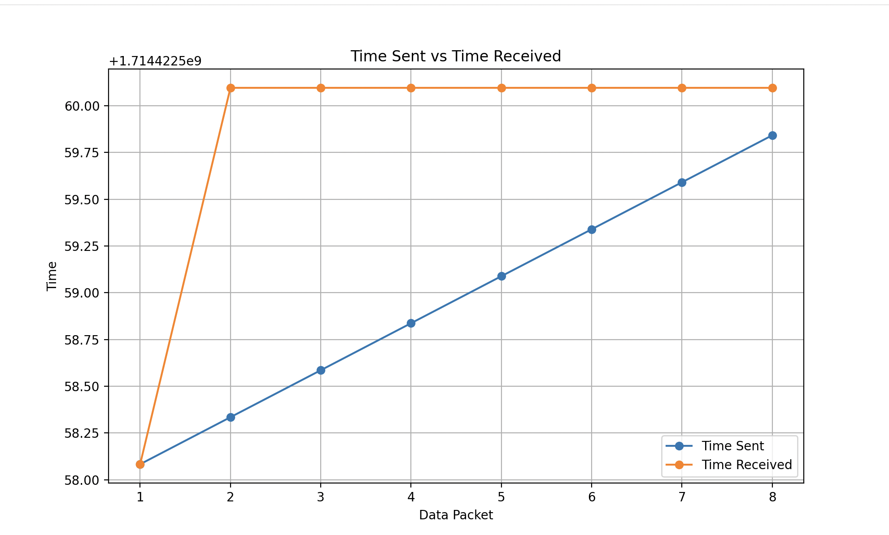

# Notre Dame Computer Networks Research: QUIC Findings

During the course of the spring semester in 2024, I conducted a series of experiments using two main QUIC open-source libraries: Aioquic and Quiche.

## Aioquic
- Started by forking this repo:
    ```bash
    git clone https://github.com/aiortc/aioquic
    ```

- The files that I specifically modified are the following:
    - aioquic/examples/http3_client.py 
    - aioquic/examples/http3_server.py
    - aioquic/dataRecollection.sh
    - aioquic/output.json
    - aioquic/output.txt
    - aioquic/setup.py
    - aioquic/parseTextToJson.py
    - aioquic/Makefile
    - aioquic/createGraph.py


> The code is originally structured so client sends data to the server. I had to switch this logic so that the client send a GET request to the server and it responds with the data. 
> The code was also modified so the user could add interval, size, and count as arguments. 

- This is how to run the example server and client:
    ```bash
        python examples/http3_server.py --certificate tests/ssl_cert.pem --private-key tests/ssl_key.pem -interval 0.250 -size 100 -count
        python examples/http3_client.py --ca-certs tests/pycacert.pem https://localhost:4433/
    ```
- By running "make", the scripts will run in order. Type this command after the "make" to see the results in a graph format:
    ```bash
        python createGraph.py
    ```

- Key findings:
    - Aioquic's asynchronous logic doesn't allow for packet separation upon reception. 
        - All the packets, even though they were sent out individually, were bundled together and delivered at the same time as shown by this graph. 
        


## Quiche
- Started by forking this repository.
```bash
https://github.com/cloudflare/quiche
```

- The files that I specifically modified:
    - quiche/apps/src/bin/quiche-client.rs
    - quiche/apps/src/bin/quiche-server.rs
    - quiche/apps/bin/args.rs
    - quiche/apps/bin/client.rs
    - quiche/apps/bin/common.rs
    - quiche/apps/Cargo.toml
    - quiche/examples/server.rs

- To run this:
```bash
cargo run --bin quiche-server -- --cert apps/src/bin/cert.crt --key apps/src/bin/cert.key
cargo run --bin quiche-client -- --no-verify https://127.0.0.1:4433/
```
   - This will send a couple of packet from the client to the server. 
   - Before my research was over I was trying to figure out how to have the server send the message to the client and modify the existing flags found in args.rs to modify the size of the packets and the gaps between them. 
    - This link proved to be quite helpful: [Beginner Issue Section Help](https://github.com/cloudflare/quiche/issues/1518)


- Shifting over to a Rust based project was a good learning experience. Here are some of the resources I used to aid my learning process:
    - [Rust for the impatient](https://www.youtube.com/watch?v=br3GIIQeefY&t=242s)
    - [5 things I wish I knew before learning Rust](https://www.youtube.com/watch?v=EYCBm0xAWow)
    - [Rust tutorial full course](https://www.youtube.com/watch?v=ygL_xcavzQ4)


